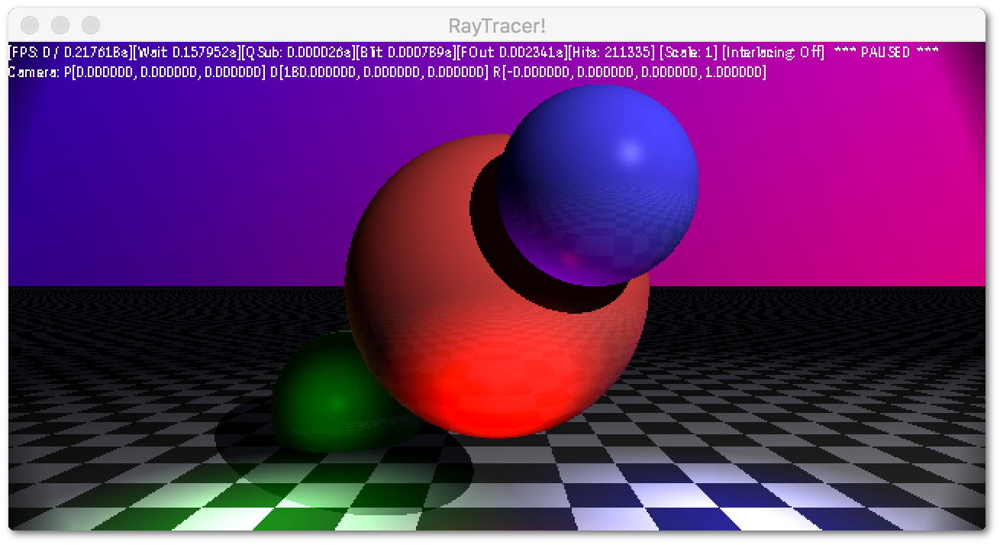

# RayTracer

A well meaning RayTracer using C++11 Threads and SDL.



## The build file is pretty janky..

### Windows
Yeah, its a Windows batch file that uses Visual Studio's cl.exe,
the dependancies location is hardwired and all that. Just look in the
build.bat :poop:

You'll need some DLLs to get this running once you've survived the build process too,
pretty much the SDL DLLs.

- libfreetype-6.dll
- SDL2.dll
- SDL2_ttf.dll
- zlib.dll

### Unixy things
Well it was tested on clang, anyway. There is a classic Makefile you
can twiddle with. Make sure you have SDL2[_image|_ttf] installed.

## Runtime options
```
-b<Number of bounces>       - Max number of bounces
-h<height>                  - Window Height
-i                          - Interlace Mode
-r                          - Realtime Mode
-t<Number of threads>       - Number of threads to spawn
-w<width>                   - Window Width
```

## Controls

```
- WASDQE        			- Move Camera
- Arrowkeys     			- Angle Camera
- Space         			- Next frame (when not running realtime)
- 1-4           			- Set Scaling
- PAUSE         			- Toggle Realtime
- I             			- Toggle Interlacing
- O             			- Toggle Shaddows
- R             			- Toggle Reflections
- T             			- Toggle Threading Info
- V             			- Toggle Vignette
```

## Font

http://www.1001fonts.com/carrois-gothic-font.html

Copyright (c) 2011 by Ralph du Carrois, with Reserved Font Name 'Carrois'
This Font Software is licensed under the SIL Open Font License, Version 1.1.
This license is copied below, and is also available with a FAQ at:
http://scripts.sil.org/OFL
